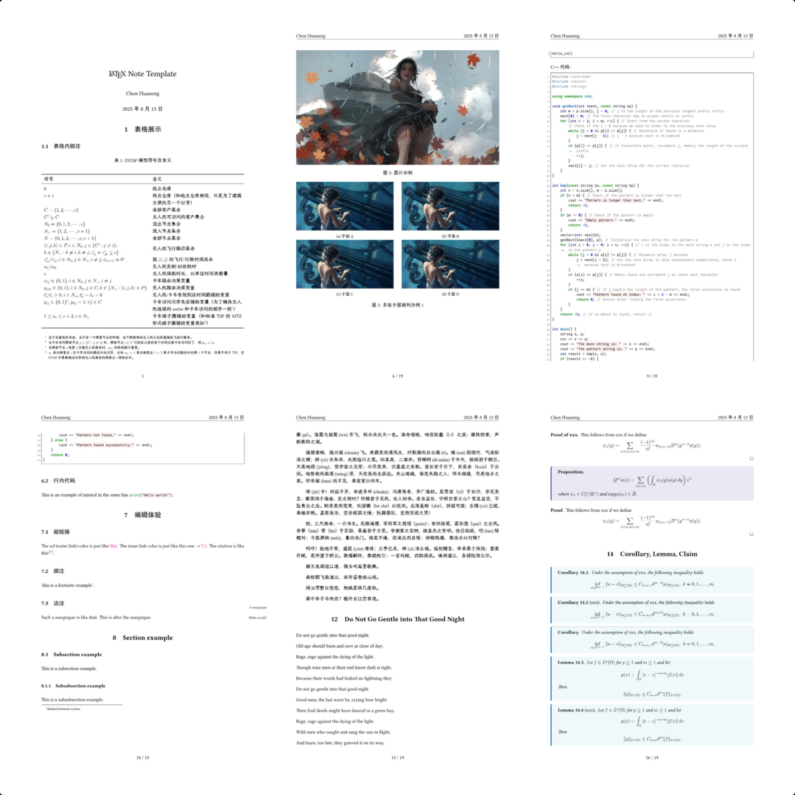

# latex-template

The $\LaTeX$ template for notes and books. 

## Template for books

Preview the outcome by click [this link](https://github.com/chen-huaneng/note-template/blob/main/main.pdf). This project is inspired by [tarekhajjshehadi/LaTeXAestheticTemplate](https://github.com/tarekhajjshehadi/LaTeXAestheticTemplate).

## Template for notes

Preview the outcome by click [this link](https://github.com/chen-huaneng/latex-template/blob/main/note/main.pdf). This project is inspired by [fenglielie/latexzero: LaTeX Templates for Mathematical Notes](https://github.com/fenglielie/latexzero). 

## Usage

Download the whole project and compile the `main.tex` by `xelatex` separately.
